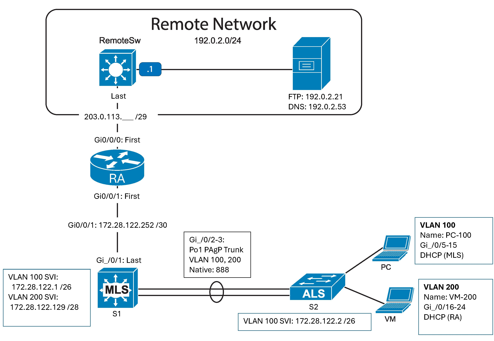

# Layer 2 Switch Security Lab 
This lab focuses on securing Layer 2 switching operations in a campus network. You’ll configure VLANs, VTP, DHCP, port security, and DHCP snooping to protect against common network threats while maintaining host connectivity.

**Devices Used**
- Router (RA)
- Multi Layer Switch (MLS)
- Layer 2 Switch (ALS)
- PCs and VMs simulating hosts

--- 
**NOTE**
This lab was done at Algonquin College, offered in the Routing and Switching course (CST8315) in the Computer Systems Technician - Networking course. I just found this lab really fun and intresting!

---
## Networking Topology

---

# Part 1 - Initial Setup
- Power on devices
- Verify no previous configs are on devices before continuing with the lab
- Do basic config (refer to Basic Confg)
- Verify neighboring connectiongs via: *show cdp neighbors* in privilege exec 
